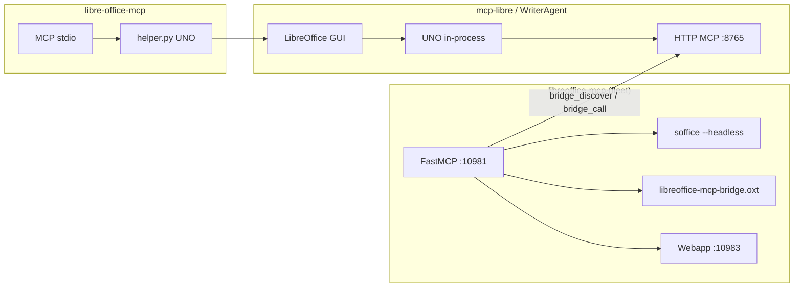

# Comparison: libreoffice-mcp vs other LibreOffice MCP projects

Last reviewed: **2026-06-02** (public GitHub READMEs / docs; not a line-by-line audit).

This document compares **sandraschi/libreoffice-mcp** (fleet server) with the main open-source LibreOffice MCP ecosystems so we know what to **reuse**, **proxy**, or **build**.

---

## Executive summary

| Dimension | **libreoffice-mcp** (this repo) | **mcp-libre** family (extension) | **libre-office-mcp** (UNO helper) | **WriterAgent** (extension + AI) |
|-----------|----------------------------------|----------------------------------|-------------------------------------|----------------------------------|
| **Primary role** | Fleet headless automation + dashboard + Tauri | In-LO live UNO MCP on `:8765` | Writer-only UNO via sidecar process | Writer/Calc/Draw + built-in LLM + optional MCP |
| **LibreOffice required** | Yes (`soffice`, not bundled) | Yes (GUI + extension) | Yes (GUI + UNO bridge) | Yes |
| **Default transport** | HTTP `:10981` + stdio MCPB | Extension HTTP `:8765` | stdio MCP + socket to helper | Optional MCP on configurable port |
| **Headless batch** | **Core** (convert, watch, jobs DB) | Secondary (export via tools) | Weak / none | Not focus |
| **Writer live edit** | Typewriter + `.oxt` bridge; proxy `:8765` | **Core** (paragraph/cursor/track changes) | **Core** (tables, headings, images) | **Core** + AI menus |
| **Calc** | Convert only | `read_spreadsheet_data` (patrup README); create calc docs | Not implemented | AI in Calc |
| **Impress / Draw** | Convert only | Create docs; limited tool docs | Not implemented | Draw + Writer focus |
| **Fleet (Fritz, ports, MCPB)** | **Yes** | No | No | No |
| **Maturity** | 0.3.x alpha, 47+ pytest, webapp e2e | Active extension lineage, many forks | Writer-centric, smaller surface | Large extension, different goals |

**Strategy:** Keep libreoffice-mcp as the **fleet control plane** (headless, templates, PDF merge, coworker). **Filch** behavior from mcp-libre / libre-office-mcp via `bridge_call` or porting patterns—not by merging codebases blindly (license + port collision on `:8765`).

---

## Projects in scope

| Project | Repo | Architecture |
|---------|------|----------------|
| **libreoffice-mcp** | [sandraschi/libreoffice-mcp](https://github.com/sandraschi/libreoffice-mcp) | Python FastMCP 3.3, `soffice --headless`, optional `libreoffice-mcp-bridge.oxt`, `bridge_discover` / `bridge_call` → `:8765` |
| **mcp-libre** (lineage) | [patrup/mcp-libre](https://github.com/patrup/mcp-libre), [jwingnut/mcp-libre](https://github.com/jwingnut/mcp-libre), [u9401066/mcp-libre](https://github.com/u9401066/mcp-libre), [JM-Addington/mcp-libre](https://github.com/JM-Addington/mcp-libre) | LibreOffice **extension** embeds HTTP MCP; external FastMCP bridge; UNO in-process |
| **libre-office-mcp** | [harshithb3304/libre-office-mcp](https://github.com/harshithb3304/libre-office-mcp) (+ forks e.g. LoboGuardian) | `helper.py` UNO + `libre.py` MCP + launcher; **Writer-only** tool list |
| **WriterAgent** | [KeithCu/writeragent](https://github.com/KeithCu/writeragent) | Full LO extension (AI UI); optional MCP; credits [quazardous/mcp-libre](https://github.com/quazardous/mcp-libre) patterns |
| **Nelson MCP** | Referenced in our `bridge.py` hints | Third-party extension MCP (same integration pattern as WriterAgent) |

**Not compared here:** MarkItDown (read-only Office→Markdown), Excel-specific MCPs (COM), or Microsoft Work IQ (cloud Word)—different problem class. See prior chat / M365 comparison if needed.

---

## Feature matrix (detailed)

Legend: ● native in repo · ○ via optional bridge (`:8765`) · — not available · ◐ partial

| Capability | libreoffice-mcp | mcp-libre (jwingnut docs) | libre-office-mcp | WriterAgent |
|------------|-----------------|---------------------------|------------------|-------------|
| Headless convert (batch) | ● | ○ export actions | — | — |
| ODT `{{placeholder}}` merge + markdown body | ● | — | — | — |
| PDF merge (pypdf) | ● | — | — | — |
| Folder watch → auto-convert | ● | — | — | — |
| SQLite job queue + webapp | ● | — | — | — |
| MCPB + Tauri installer | ● | extension `.oxt` only | — | LO extension |
| `live_write` typewriter | ● (own `.oxt`) | ○ live sessions | — | ● AI typing |
| UNO Basic/Python macros | ● (own `.oxt`) | ● | via helper | ● |
| Create Writer/Calc/Impress/Draw | ○ headless implicit | ● `document(create)` | ● Writer only | ● |
| Read document text | ○ convert/extract | ● `document(content)` | ● open/read | ● |
| **Read spreadsheet cells** | — | ● `read_spreadsheet_data` (upstream README) | — | ○ |
| Paragraph / outline navigation | — | ● `structure`, `cursor` | ○ headings | ● |
| Insert / format / selection ops | ○ typewriter chunks | ● `text`, `selection` | ● bold, tables, images | ● |
| Search & replace | — | ● `search` (track-aware) | ● | ● |
| Track changes accept/reject | — | ● `track_changes` | — | ? |
| Comments add/list | — | ● `comments` | — | ? |
| Watch document changes | — | ● (patrup: `watch_document_changes`) | — | — |
| Batch convert many files | ● `convert_batch` | ● `batch_convert_documents` | — | — |
| Merge multiple text docs | ● `batch_pack` (md→PDF) | ● `merge_text_documents` | — | — |
| Search files by content | — | ● `search_documents` | ○ list dir | — |
| Document statistics | — | ● `get_document_statistics` | ○ properties | — |
| Built-in LLM / Copilot UI | ○ Chat + Ollama `live_write` | — | — | ● core product |
| Delegate to sub-toolset | — | — | — | ● `delegate_to_specialized_writer_toolset` |
| Fleet ports 10981/10983 | ● | — | — | — |
| Fritz coworker templates | ● | — | — | — |

---

## Architecture contrast



**Port conflict:** Only one listener should own **8765** (mcp-libre extension vs WriterAgent MCP). libreoffice-mcp defaults `EXTENSION_BRIDGE_URL=http://127.0.0.1:8765/mcp` — configure whichever extension you install.

**Our bridge vs their extension:** `libreoffice-mcp-bridge.oxt` polls **10981** for a typewriter queue; mcp-libre **is** the MCP server inside LO. Complementary: fleet server orchestrates; mcp-libre executes rich UNO edits.

---

## Per-project notes

### sandraschi/libreoffice-mcp (this repo)

**Strengths**

- Industrial fleet packaging: FastMCP 3.3, prefabs, skills, agentic sampling, REST mirror, Playwright e2e.
- Headless pipelines at scale: jobs, watch folder, rich ODT merge, PDF merge, multi-format batch.
- First-class **hands-in/hands-out** story for agents (documented in README).
- Shipped **fleet** `.oxt` for typewriter + macros without requiring mcp-libre install.
- Proxies third-party tools without forking them.

**Gaps vs extension MCPs**

- No paragraph-level Writer API in-process (except via `bridge_call` or typewriter).
- Calc: no `read_spreadsheet_data` / cell write (convert only).
- No track changes / comment tools natively.
- Draw: detection only.

### mcp-libre (patrup / jwingnut / forks)

**Strengths**

- Direct UNO: fast live edit, multi-document, consolidated tools (9 groups in jwingnut `TOOL_REFERENCE.md`).
- Writer depth: structure, cursor, selection, search, **track changes**, comments.
- Spreadsheet read in upstream tool table (`read_spreadsheet_data`).
- Documented HTTP API on **8765** — matches our bridge design.

**Gaps**

- Not a fleet server: no Fritz templates, no Tauri/MCPB story, no headless job DB.
- Tool docs emphasize **Writer** in architecture diagrams; Calc/Impress tooling is thinner than marketing bullets.
- Many forks (patrup, jwingnut, u9401066, JM-Addington) — pick **one** canonical fork for integration tests.

**Filch priority: HIGH** (behaviors to proxy or port).

### harshithb3304/libre-office-mcp

**Strengths**

- Clear UNO helper pattern (socket RPC to `helper.py`).
- Rich **Writer** formatting: headings, tables with borders/colors, images, search/replace, partial page breaks.
- Good reference for **table construction** in UNO if we implement Writer ops natively.

**Gaps**

- Writer only (roadmap lists Calc/Impress unchecked).
- No extension HTTP; must run helper + LO GUI.
- No fleet automation layer.

**Filch priority: MEDIUM** (Writer table/format recipes; architecture less relevant if we standardize on mcp-libre bridge).

### KeithCu/writeragent

**Strengths**

- Production-grade LO extension with AI features across Writer/Calc/Draw.
- Optional MCP for external agents; **delegate** pattern for specialized sub-agents.
- Explicit lineage from mcp-libre (build/tool registry ideas).

**Gaps**

- Different product (embedded LLM, settings UI)—not a drop-in headless server.
- MCP tool list is “core + delegate”; integrators must read `docs/mcp-protocol.md`.

**Filch priority: MEDIUM** (delegate pattern for fleet-agent; use as optional `:8765` backend, not merge repos).

---

## What to filch (prioritized backlog)

### Tier A — High impact, aligns with fleet

| # | Source | What to take | Implementation idea |
|---|--------|--------------|---------------------|
| A1 | mcp-libre | `read_spreadsheet_data` | Add `calc_read` op (or `bridge_call` wrapper doc); native: openpyxl + ODS path |
| A2 | mcp-libre | `structure` / `cursor` / `selection` | Extend Writer bridge queue actions beyond typewriter; or document `bridge_call` recipes |
| A3 | mcp-libre | `track_changes` + `comments` | Coworker/legal workflows; proxy via `bridge_call` first |
| A4 | mcp-libre | `search` (track-aware replace) | Agentic merge cleanup before PDF export |
| A5 | libre-office-mcp | Table create/format UNO | If we add native UNO Writer module, port helper patterns |
| A6 | patrup README | `watch_document_changes` | Complement our folder watch (file system) with open-doc watch via bridge |
| A7 | WriterAgent | `delegate_to_specialized_writer_toolset` | fleet-agent recipe: outer MCP plans, inner toolset for one-shot LO tasks |

### Tier B — Nice to have

| # | Source | What to take |
|---|--------|--------------|
| B1 | mcp-libre | `get_document_statistics` | QA / coworker report metadata |
| B2 | mcp-libre | `search_documents` | Index under `~/.libreoffice-mcp` outputs |
| B3 | mcp-libre | `merge_text_documents` | Compare with `batch_pack`; unify markdown merge story |
| B4 | mcp-libre | `create_live_editing_session` | Marketing parity with `live_write`; SSE already exists |
| B5 | jwingnut | 9-tool portmanteau shape | Map to `libreoffice(operation=writer_*)` sub-ops to avoid 32 tools in Cursor |
| B6 | mcp-libre | Consolidated `document` tool | `document_info` + open doc list via bridge |

### Tier C — Do not filch (wrong fit)

- WriterAgent embedded chat UI (duplicate Ollama/Chat in webapp).
- Replacing `:10981` with `:8765` as primary MCP (breaks headless + MCPB).
- Merging extension codebases into one `.oxt` without license review (Apache/MIT mix—audit first).

---

## Recommended integration (today, no code)

1. Install **one** of: **jwingnut/mcp-libre** or **WriterAgent** (enable MCP, note port).
2. Run libreoffice-mcp on **10981**.
3. `libreoffice(operation='bridge_discover')` → inspect tools.
4. `libreoffice(operation='bridge_call', bridge_tool='…', bridge_arguments={…})` from agentic Chat or Fritz flows.
5. Keep **headless** paths on this server; keep **semantic edit** paths on `:8765`.

Example env:

```env
EXTENSION_BRIDGE_URL=http://127.0.0.1:8765/mcp
```

---

## Tool-count / Cursor limits

| Project | MCP tool exposure |
|---------|-------------------|
| libreoffice-mcp | Portmanteau `libreoffice` + agentic + prefabs + help (~5 MCP tools) |
| mcp-libre | 9 consolidated (+ external bridge); extension advertises 32 handlers |
| libre-office-mcp | Many granular Writer tools (risk >50 with extras) |
| WriterAgent | Core + delegate (stable `tools/list`) |

Our portmanteau model is a **fleet standard** (see MCD)—keep it; absorb mcp-libre **actions** as sub-operations or bridge proxies, not 32 top-level tools.

---

## License / maintenance checklist before copying code

| Repo | License (verify on clone) | Fork churn |
|------|---------------------------|------------|
| patrup/mcp-libre | Check `LICENSE` | High (many forks) |
| jwingnut/mcp-libre | Check `LICENSE` | Active docs |
| harshithb3304/libre-office-mcp | Check `LICENSE` | Moderate |
| WriterAgent | Check `LICENSE` | Active extension |
| libreoffice-mcp | MIT (project) | Fleet canonical |

Prefer **MIT-compatible** snippets; attribute in `NOTICE` if copying UNO bridge code.

---

## Related docs (this repo)

- [EXTENSION_BRIDGE.md](EXTENSION_BRIDGE.md) — our `.oxt` + macros
- [LIVE_WRITER.md](LIVE_WRITER.md) — typewriter lane
- [FEATURES.md](FEATURES.md) — current capabilities
- [TOOLS.md](TOOLS.md) — portmanteau operations
- [CONFIGURATION.md](CONFIGURATION.md) — `EXTENSION_BRIDGE_URL`

## MCD mirror

Fleet overview: [mcp-central-docs/projects/libreoffice-mcp/README.md](../../mcp-central-docs/projects/libreoffice-mcp/README.md) (update status separately).

---

## Changelog for this document

| Date | Change |
|------|--------|
| 2026-06-02 | Initial comparison from public READMEs and jwingnut TOOL_REFERENCE |
| 2026-06-02 | Calc .oxt bridge + `libreoffice_calc` portmanteau shipped; mcp-libre cloned to `external/mcp-libre` |
